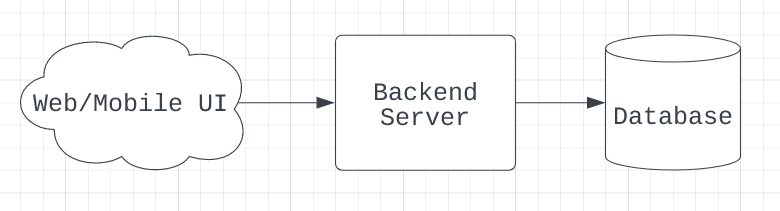

**Assumptions**
1. Based on https://blog.switcheo.com/introducing-switcheo-tradehub-the-next-evolution-in-decentralized-cross-chain-trading/, 
transaction volume is estimated at 1000 queries per second. 
2. We assume there will be more writes than reads since users would be more interested in the transactions related to them. 
3. We also assume that 10% of users will be active at any one point of time. 

**Functional Requirements**

The system needs to be available at all times, due to the requirement that an admin should be able to retry a failed broadcast at any point of time. 
The system must also have partition tolerance, so that when a node drops the request/message due to system restart, the request is eventually fulfilled. 

**APIs** 

There is an internal API as mentioned in the specifications. 

```
POST /broadcast_transaction 

Params: message_type: string, data: string.
Returns: a signed transaction, HTTP response code 
```

Since this API can only be used by the admins, we can add APIs for admin account creation and authentication. 

```
POST /create_account 
Params: email: string, password: hashed string, first_name (optional): string, last_name (optional): string
Returns: a User object which has the address assigned to it
```

```
POST /login 
Params: email: string, password: string
Returns: a created session 
```

```
DELETE /login - destroys the created session 
```

Besides that, I would like to propose adding a public API for users to see the list of passed and failed transactions. 

```
GET /transactions

It would have an empty request body, and it returns a list of signed transactions. 
```

**Database schema** 

Users 


| Attribute         | data type         |
|------------|--------------------------------|
| id | primary key, serial    |
| user_id    |foreign key, int                |
| address    | address, foreign key           |
| email      | varchar                        |
| password   | varchar, probably SHA-256 hash |
| first_name | varchar                        |
| last_name  | varchar                        |
|||

Transactions

| Attribute | data type |
|------------|------------|
| id | primary key, serial |
| transaction_id | foreign key, int |
| from_address | address |
| to_address | address |
| weight | uint |
| data | varchar |
| time | timestamp |
| broadcast_status | enum(success, failure) |

**Architecture**

I propose a monolithic architecture since the application does not have high complexity. 
It has 2 main features, which are user management and transaction handling. 

It would not make sense to adopt a microservice architecture due to the following reasons: 

1. Higher costs. Each microservice deployed independently would require its own runtime environment and CPU, resulting in higher resource demand.
There is also extra time needed to create APIs for the microservices to interact with one another, and to to test the communication
between the microservices. The high number of remote calls can lead to higher costs associated with network latency and processing.

2. Cross-cutting concerns. Each microservice will have to deal with concerns like logging, metrics, health checks, externalized configuration etc. 
We could accept the overhead of separate modules for each concern, or encapsulate these concerns into another service layer 
through which all traffic gets routed.

However, there would be some trade-offs in using monolithic architecture: 
1. We can only scale horizontally, which in turn creates many other issues. 
2. Since the architecture is centralised, the individual parts are highly coupled and depended on each other. 
This results in a single point of failure that can bring down the entire system.


 